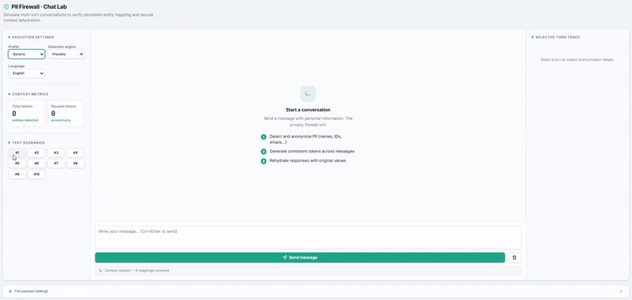

# PII Firewall

[](https://www.python.org/downloads/)
[](https://opensource.org/licenses/Apache-2.0)
[](https://pypi.org/project/pii-firewall/)

Open-source PII firewall for LLM apps. Intercept sensitive data before it reaches any model provider, then restore it transparently in the response.

**[Website](https://pii-firewall.com/) · [Documentation](https://pii-firewall.com/documentation)**

<p align="center">
  
</p>

---

## The problem in one diagram

```
User text  ──►  [ PII Firewall ]  ──►  Sanitized prompt  ──►  LLM
                      │                                          │
                 Secure vault                             Model response
                      │                                          │
                      └──────────  Re-hydrated reply  ◄─────────┘
```

Standard redaction breaks LLM context — if you replace `"John"` with `[REDACTED]`, the model can no longer refer to the person by name in its response. PII Firewall solves this with a stateful **Detect → Anonymize → Rehydrate** flow:

1. **Detect** — finds PII using configurable backends (regex, Presidio, GLiNER, Transformers, and more).
2. **Anonymize** — replaces entities with reversible tokens (`PERSON_1`, `EMAIL_1`) or applies one-way transforms (generalize, mask, hash).
3. **LLM call** — the cleaned prompt goes to the model. No real data leaves your system.
4. **Rehydrate** — the response is restored from a secure vault before reaching the user.

---

## Quick start

```bash
pip install "pii-firewall[presidio,langdetect]"
python -m spacy download en_core_web_sm
```

```python
from privacy_firewall import create_firewall

firewall = create_firewall("healthcare")

result = firewall.secure_call(
    text="Patient John Doe, SSN 123-45-6789, diagnosed with hypertension. Prescribed lisinopril 10mg.",
    context={
        "tenant_id": "hospital-001",
        "case_id":   "patient-123",
        "thread_id": "consultation-1",
        "actor_id":  "doctor-456",
    },
    llm_client=my_llm_function,   # any callable: OpenAI, Anthropic, LangChain, etc.
)

print(result.sanitized_text)   # what the LLM saw:  "Patient PERSON_1, REDACTED, diagnosed with hypertension..."
print(result.final_text)       # what the user gets: original names restored
```

### Pick your domain profile

| Profile | Behaviour |
|---|---|
| `healthcare` | Pseudonymizes patient identifiers; keeps diagnoses, medications, procedures |
| `finance` | Masks card numbers; pseudonymizes account numbers and IBANs; keeps amounts |
| `legal` | High anonymity; pseudonymizes party names; generalizes dates to month/year |
| `generic` | Balanced defaults for any use case |

```python
firewall = create_firewall("healthcare")   # or "finance", "legal", "generic"
```

---

## Connect your LLM

### Any callable — OpenAI, Anthropic, etc.

```python
from openai import OpenAI
from privacy_firewall import create_firewall

client = OpenAI()
firewall = create_firewall("generic", detector_backend="presidio")
context = {"tenant_id": "acme", "case_id": "c1", "thread_id": "t1", "actor_id": "u1"}

def my_llm(prompt: str) -> str:
    resp = client.chat.completions.create(model="gpt-4o", messages=[{"role": "user", "content": prompt}])
    return resp.choices[0].message.content

result = firewall.secure_call(text=user_input, context=context, llm_client=my_llm)
print(result.final_text)   # real names restored
```

### Streaming (SSE / WebSocket)

The firewall intercepts each chunk, detects tokens in real-time, and rehydrates them on the fly — no extra latency in the UI.

```python
for token in firewall.secure_call_stream(text=user_input, context=context, llm_client=streaming_llm):
    yield token
```

### FastAPI / manual flow

```python
from fastapi import FastAPI
from privacy_firewall import PrivacyFirewallSDK

app = FastAPI()
sdk = PrivacyFirewallSDK.create(domain="healthcare", detector_backend="presidio")

@app.post("/chat")
async def chat(req: dict):
    context = req["context"]
    anon = sdk.anonymize_text(text=req["message"], context=context)
    llm_response = await call_your_llm(anon.sanitized_text)
    final = sdk.rehydrate_text(text=llm_response, context=context)
    return {"response": final}
```

---

## Detection backends

Choose the right backend for your accuracy/latency needs:

| Backend | Install extra | Best for | Latency |
|---|---|---|---|
| `regex` | *(none)* | Structured IDs, emails, phones — zero dependencies | < 1 ms |
| `presidio` | `[presidio,langdetect]` | Named entities — recommended default | 50–200 ms |
| `hybrid` | `[presidio,langdetect]` | Regex + Presidio for maximum coverage | 50–250 ms |
| `gliner` | `[gliner]` | Zero-shot NER, no fine-tuning needed | 100–400 ms |
| `transformers` | `[transformers]` | Domain-specific models (biomedical, legal) | 100–500 ms |
| `nemotron` | `[opf]` | NVIDIA fine-tune, high recall on free text | 100–300 ms |

```python
firewall = create_firewall("healthcare", detector_backend="hybrid")
```

---

## Multi-language support

Language is detected automatically — no configuration needed. After the first message per thread, detection is cached at 0 ms overhead. Locale-specific patterns fire for:

- 🇺🇸 US: SSN, EIN, passport numbers
- 🇪🇸 ES: DNI, NIE, tax ID
- 🇫🇷 FR: INSEE, SIRET
- 🇩🇪 DE: Steuernummer, Personalausweis
- 🇮🇹 IT: Codice Fiscale
- 🇵🇹 PT: NIF, CC
- 🌐 Global: email, phone, IBAN, credit card, IP, URL, and more

55+ languages detected; add a new locale in [3 steps](#extending-with-new-locales).

---

## Anonymization actions

Each entity type gets its own **disposition rule** — not every entity should be treated the same way:

| Action | What it does | Reversible? |
|---|---|---|
| `PSEUDONYMIZE` | Replaces with a vault token (`PERSON_1`) — restored in rehydration | ✅ Yes |
| `GENERALIZE` | Coarses the value: age `43` → `40-49`, date → year, location → city | ❌ One-way |
| `MASK` | Replaces characters with `*`, keeps configurable trailing digits (`****4242`) | ❌ One-way |
| `HASH` | SHA-256/SHA-512 digest — consistent opaque ID, no vault entry | ❌ One-way |
| `REDACT` | Hard removal — replaced with `[REDACTED]` | ❌ One-way |
| `KEEP` | Entity detected but passed through untouched | — |

Each disposition also has a **confidence threshold** — detections below it are silently ignored, preventing noisy NER guesses from corrupting clean text.

---

## Using HuggingFace transformer models

Point the firewall at any token-classification model on the HF Hub:

```python
firewall = create_firewall(
    "healthcare",
    detector_backend="transformers",
    transformer_model_id="d4data/biomedical-ner-all",  # any HF model ID
    transformer_device=0,   # 0 = first GPU, -1 = CPU (default)
)
```

The model is downloaded and cached on first use (lazy loading). If you do not specify a model ID, a curated default is selected for your domain and language:

| Domain | Language | Default model |
|---|---|---|
| General | `en` | `dslim/bert-base-NER` |
| General | multilingual | `Davlan/xlm-roberta-base-ner-hrl` |
| General | `fr` | `Jean-Baptiste/camembert-ner` |
| Medical | `en` | `d4data/biomedical-ner-all` |
| Medical | `es` | `PlanTL-GOB-ES/bsc-bio-ehr-es` |

Models following CoNLL-2003 (`PER`, `ORG`, `LOC`) and standard biomedical label conventions are supported out of the box. For custom label names, subclass `DomainTransformerNEREngine` and override `_normalize_entity_type()`.

---

## Custom patterns and recognizers

### Regex pattern — any backend

```python
import re
from privacy_firewall.patterns.catalog import EntityPattern

firewall.add_custom_pattern(EntityPattern(
    entity_type="EMPLOYEE_ID",
    locale="GLOBAL",
    pattern=re.compile(r"\bEMP-\d{6}\b"),
    confidence=0.95,
    context_words=("employee", "staff id"),
    description="Internal employee identifier",
))
```

### Custom Presidio recognizer

```python
from privacy_firewall.presidio_integration import create_custom_recognizer

recognizer = create_custom_recognizer(
    entity_type="CASE_NUMBER",
    patterns=[r"\bCASE-\d{8}\b"],
    context_words=["case", "docket"],
    score=0.9,
)

firewall = create_firewall("legal", detector_backend="presidio", custom_recognizers=[recognizer])
```

---

## GDPR right to forget

```python
# Purge all vault mappings for a case — satisfies GDPR Art. 17
deleted = firewall.forget(tenant_id="hospital-001", case_id="patient-123", thread_id="thread-1")
print(f"Deleted {deleted} token mappings")
```

Vault entries also support TTL: sensitive mappings expire automatically after a configured period, with no manual cleanup required.

---

## Running the playground locally

**Prerequisites:** Python 3.10+, Node.js 18+

### 1 — Backend

```bash
cd pii-firewall
pip install -e ".[web,presidio,langdetect]"
uvicorn privacy_firewall.web.app:create_app --factory --reload --port 8080
```

API docs: http://127.0.0.1:8080/docs

### 2 — Frontend

```bash
cd pii-web-next
cp .env.example .env.local        # macOS / Linux
# Copy-Item .env.example .env.local  # Windows PowerShell
npm install
npm run dev
```

UI: http://127.0.0.1:3010

---

## Extending with new locales

Add a new country in 3 steps:

**1. Create the pattern file** (`pii-firewall/src/privacy_firewall/patterns/locales/nl_patterns.py`):

```python
import re
from ..catalog import EntityPattern

NL_BSN = EntityPattern(
    entity_type="NATIONAL_ID",
    locale="NL",
    pattern=re.compile(r"\b\d{9}\b"),
    confidence=0.9,
    context_words=("bsn", "burgerservicenummer"),
    description="Dutch BSN",
)

NL_PATTERNS = [NL_BSN]
```

**2. Register it** in `patterns/locales/__init__.py`:

```python
from .nl_patterns import NL_PATTERNS
LOCALE_PATTERNS = [...existing...] + NL_PATTERNS
```

**3. Optionally add a language config** in `language/router.py` for spaCy model selection:

```python
"nl": LanguageConfig(language_code="nl", spacy_model="nl_core_news_sm", patterns_locale="NL"),
```

Done — Dutch patterns are now active automatically.

---

## How it compares

| Feature | PII Firewall | Presidio | scrubadub | AWS Comprehend |
|---|---|---|---|---|
| Domain-aware (keep relevant data) | ✅ | ❌ | ❌ | ⚠️ Healthcare only |
| Multi-language auto-detect | ✅ 55+ | ✅ Manual | ❌ English only | ✅ Some |
| Locale-specific patterns | ✅ Per-country | ❌ | ❌ | ❌ |
| Multiple disposition actions | ✅ 6 actions | ❌ Basic | ❌ | ❌ |
| HuggingFace transformer support | ✅ | ❌ | ❌ | ✅ Proprietary |
| Reversible pseudonymization | ✅ Vault | ❌ | ❌ | ❌ |
| Streaming rehydration | ✅ | ❌ | ❌ | ❌ |
| GDPR right to forget | ✅ | ❌ | ❌ | N/A |
| Custom patterns at runtime | ✅ | ⚠️ Code only | ⚠️ Code only | ❌ |
| Open source | ✅ | ✅ | ✅ | ❌ |

---

## Repository structure

```
/pii-firewall     Python SDK + FastAPI server
/pii-web-next     Playground UI (Next.js)
```

---

## License

Apache 2.0. See [pii-firewall/LICENSE](pii-firewall/LICENSE).